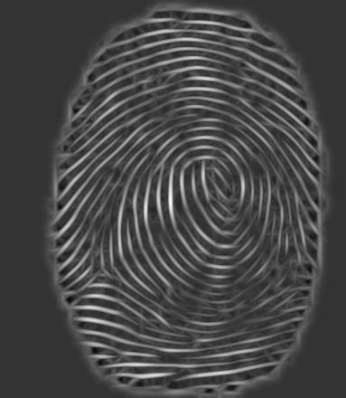
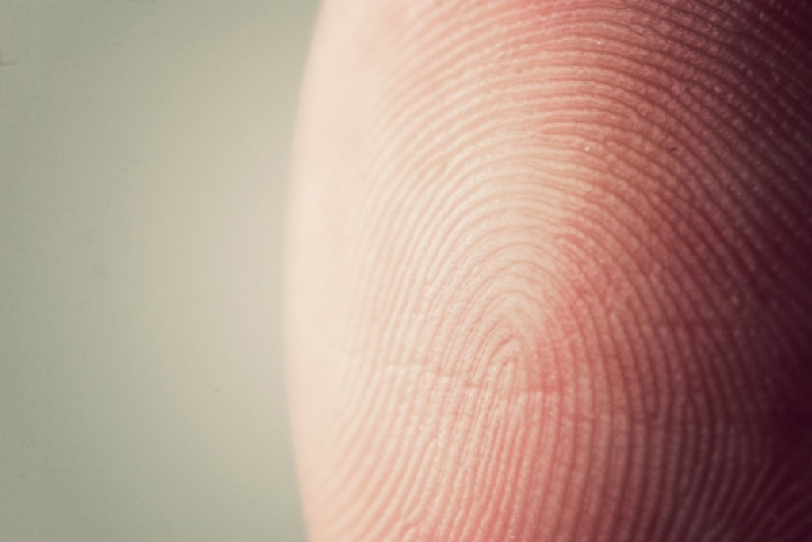
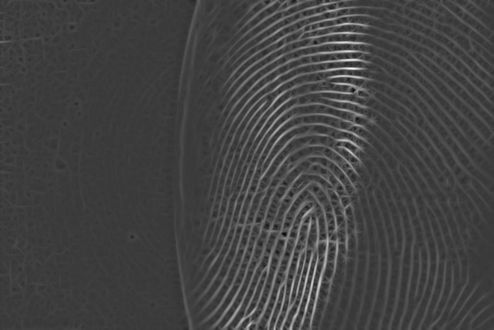
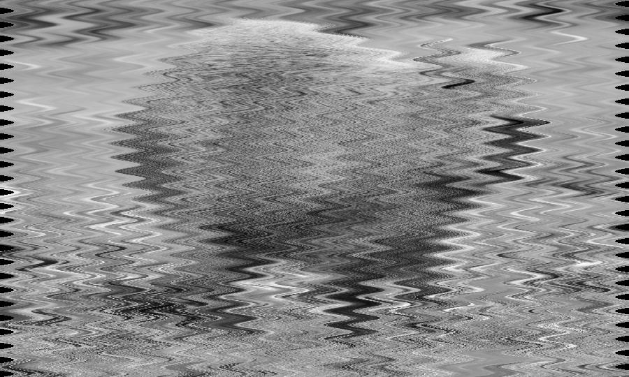
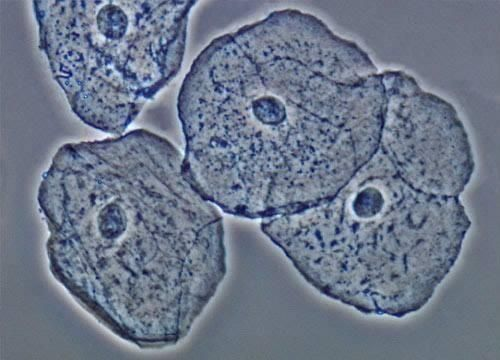
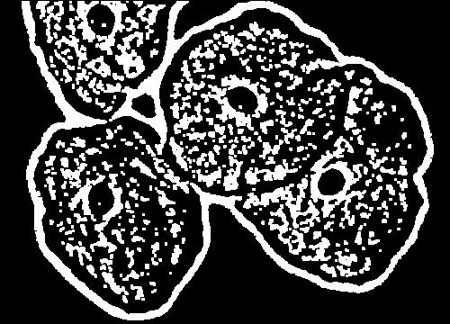

# Processamento Básico de Imagens

Conjunto de filtros criados em python

## 📌 Índice

- [Contrate e Brilho](#sobre-o-projeto)
- [Redução de Ruídos](#tecnologias-utilizadas)
- [Detecção de Bordas](#instalação)
- [Detecção de Formas e Texturas](#como-usar)
- [Transformações Geométricas](#funcionalidades)
- [Filtros Morfológicos](#autores)

---

## Contraste e Brilho

Definição da função principal responsável pelo ajuste de contraste e brilho. Ela recebe como parâmetros a imagem que será processada, além dos novos valores de contraste e brilho:
```python
 def ajutarBrilhoEContrate(imagem, brilho, contraste):

    largura, altura = imagem.size
    nova_imagem = Image.new("RGB", (largura, altura))
    pixels_originais = imagem.load()
    pixels_novos = nova_imagem.load()

    for x in range(largura):
        for y in range(altura):
            r, g, b = pixels_originais[x, y]

            r = int(contraste * r + brilho)
            g = int(contraste * g + brilho)
            b = int(contraste * b + brilho)

            r = max(0, min(255, r))
            g = max(0, min(255, g))
            b = max(0, min(255, b))

            pixels_novos[x, y] = (r, g, b)

    return nova_imagem

```


Dentro da função, utilizei `imagem.size` para capturar a largura e altura da imagem original. Em seguida, criei uma nova imagem com as mesmas dimensões e carreguei os pixels tanto da imagem original quanto da nova imagem que será gerada com o filtro aplicado:
```python
    largura, altura = imagem.size
    nova_imagem = Image.new("RGB", (largura, altura))
    pixels_originais = imagem.load()
    pixels_novos = nova_imagem.load()
```

Utilizo um laço `for` aninhado para pecorrendo pixel por pixel da imagem e ir fazendo as modificações no brilho e contraste. A cada iteração, os valores RGB do pixel original são ajustados aplicando o contraste e o brilho, multiplicando o valor original do pixel pelo contraste e somando o valor do brilho. A função max e min garante que os valores fiquem no intervalo entre 0 e 255. Em seguida, os novos valores são atribuídos à nova imagem:
```python
  for x in range(largura):
      for y in range(altura):
          r, g, b = pixels_originais[x, y]
  
          r = int(contraste * r + brilho)
          g = int(contraste * g + brilho)
          b = int(contraste * b + brilho)
  
          r = max(0, min(255, r))
          g = max(0, min(255, g))
          b = max(0, min(255, b))
  
          pixels_novos[x, y] = (r, g, b)

```

<table align="center">
  <tr>
    <th>Imagem Original</th>
    <th>Imagem Processada</th>
  </tr>
  <tr>
    <td align="center">
      
    </td>
    <td align="center">
      
    </td>
  </tr>
</table>

---

## Redução de Ruídos (Filtro de Média)
Definição da função que foi criada para implementar o filtro de média. Essa função recebe o caminha para a imagem e o tamanho do kernel, que por padrão está definido como 3 (3x3), assim será sempre separada uma amostra de 9 pixels onde os 8 pixels ao redor do pixels do meio serão 
utilizados para calcular a mediana.


```python
 def filtro_media(imagem_path, tamanho_kernel=3):
     imagem = Image.open(imagem_path).convert("L")
     imagem_np = np.array(imagem, dtype=np.float32)
 
     altura, largura = imagem_np.shape
     k = tamanho_kernel // 2
     imagem_filtrada = np.zeros_like(imagem_np)
 
     for y in range(k, altura - k):
         for x in range(k, largura - k):
             vizinhanca = imagem_np[y - k:y + k + 1, x - k:x + k + 1]
             media = np.mean(vizinhanca)
             imagem_filtrada[y, x] = media
 
     imagem_resultado = Image.fromarray(imagem_filtrada.astype(np.uint8))
 
     imagem_resultado.show()
     imagem_resultado.save("imagem/resultado/imagem_filtrada_media.jpg")

```
Abre a imagem e a converte para tons de cinza. E posteriormente converte a imagem para um array com valores em ponto flutuante, para facilitar os cálculos matemáticos

```python
 imagem = Image.open(imagem_path).convert("L")
 imagem_np = np.array(imagem, dtype=np.float32)
```

Já nessa parte do código, é feita uma fase de preparação, onde:
- Obtenho o valor da altura e largura da imagem
- Utilizo k para representar quantos pixels o Kernel se estende a partir do centro
- Crio uma nova imagem onde será salvo o resultado

  
```python
 altura, largura = imagem_np.shape
 k = tamanho_kernel // 2
 imagem_filtrada = np.zeros_like(imagem_np)
```
Para fazer a aplicação do filtro, utilizo o laço `for` aninhado para percorrer os pixels, onde para cada pixel extraio a vizinhança com base no tamanho do kernel e calcula a média dos valores vizinhos. E, por fim, atribui o valor ao pixels correspondente na nova imagem.

<table align="center">
  <tr>
    <th>Imagem Original</th>
    <th>Imagem Processada</th>
  </tr>
  <tr>
    <td align="center">
      
    </td>
    <td align="center">
      
    </td>
  </tr>
</table>

---

## Detecção de Bordas (Laplace)

Matriz (kernel) utilizada para detectar bordas. Ela dá peso negativo aos vizinhos e um peso alto ao valor central. Ela faz isso com o objetivo de realçar pixels que são muito diferentes dos seus vizinhos, o que acontece em bordas

```python
laplaciano = [
    [-1, -1, -1],
    [-1,  8, -1],
    [-1, -1, -1]
]
```
Dentro da função principal, primeiramente faço uma preparação obtendo a altura e largura e carregando os pixels da imagem original. Também crio uma nova imagem em tons de cinza onde será guardado o resultado do filtro

```python
 largura, altura = imagem.size
 pixels = imagem.load()
 nova_imagem = Image.new("L", (largura, altura))
 pixels_novos = nova_imagem.load()
```

Posteriormente percorro os pixels internos, com um laço `for` aninhado, ignorando as bordas.

```python
 for x in range(1, largura - 1):
     for y in range(1, altura - 1):
         soma = 0
```

Dentro do laço aninhado, utilizei mais um `for` aninhado para aplicar a máscara lapalaciana em volta de cada pixel. Se o pixel estive em RGB, ele também será convertido para tons de cinza, utilizando a fórmula de luminância

```python
        for i in range(3):
            for j in range(3):
                xi = x + i - 1
                yj = y + j - 1
                cor = pixels[xi, yj]

                if isinstance(cor, tuple):
                    cor = int(0.299 * cor[0] + 0.587 * cor[1] + 0.114 * cor[2])

```
Posteriormente multiplico o valor de cada vizinho pelo valor correspondente da máscara e acumula a soma

```python
                soma += cor * laplaciano[i][j]

```

<table align="center">
  <tr>
    <th>Imagem Original</th>
    <th>Imagem Processada</th>
  </tr>
  <tr>
    <td align="center">
      
    </td>
    <td align="center">
      
    </td>
  </tr>
</table>

---

## Detecção de Formas e Texturas (Gabor)

A função `gerar_filtro_gabor` é responsavel por gerar o filtro de Gabor, ela utiliza os seguintes parâmetros para sua execução:
- Tamanho: Tamanho do filtro
- Lambda: Comprimento de onda da senóide
- Theta: Orientação do filtro (ângulo)
- Sigma: Desvio padrão da gaussiana (define o quanto o filtro se espalha)
- PSI: Fase da onda (Define o deslocamento da senóide)
- Gamma: Razão de aspecto (define o alongamento na vertical)
O filtro é gerado a partir da combinação de uma função gaussiana com uma senóide, resultando em uma máscara sensível a bordas e texturas orientadas.

```python
 def gerar_filtro_gabor(tamanho, lambd, theta, sigma, psi, gamma):
     half = tamanho // 2
     y, x = np.mgrid[-half:half+1, -half:half+1]
 
     x_theta = x * np.cos(theta) + y * np.sin(theta)
     y_theta = -x * np.sin(theta) + y * np.cos(theta)
 
     expoente = -(x_theta**2 + (gamma**2) * y_theta**2) / (2 * sigma**2)
     seno = np.cos(2 * np.pi * x_theta / lambd + psi)
     filtro = np.exp(expoente) * seno
 
     filtro = filtro - np.mean(filtro)
     return filtro / np.sum(np.abs(filtro))
```
Já a função de equalização, é responsável por redistribuir os níveis de intensidade da imagem, melhorar o contraste e mapear os tons antigos para novos valores mais espalhados

```python
 def equalizar_histograma(imagem):
    hist, bins = np.histogram(imagem.flatten(), 256, [0, 256])
    cdf = hist.cumsum()
    cdf_normalizado = 255 * cdf / cdf[-1]
    return np.interp(imagem.flatten(), bins[:-1], cdf_normalizado).reshape(imagem.shape)

```
A função `aplicar_filtros_gabor` aplica múltiplos filtros de gabor na mesma imagem, mudando apenas as orientações dos ângulos em cada aplicação, assim fazendo uma detecção em várias direções. Posteriormente, com o `np.max` em cada pixels da nova imagem gerada é mantido apenas a maior resposta entre todos os filtros que foram aplicados, assim os detalhes mais fortes das impressões digitais aparecem

```python
  
 def aplicar_filtros_gabor(imagem_np, num_orientacoes=4):
     tamanho = 25
     lambd = 12
     sigma = 4.0
     psi = 0
     gamma = 0.5
 
     orientacoes = np.linspace(0, np.pi, num_orientacoes, endpoint=False)
     resultados = []
 
     for theta in orientacoes:
         gabor = gerar_filtro_gabor(tamanho, lambd, theta, sigma, psi, gamma)
         resultado = convolve2d(imagem_np, gabor, mode='same', boundary='symm')
         resultados.append(resultado)
 
     return np.max(np.array(resultados), axis=0)

```

<table align="center">
  <tr>
    <th>Imagem Original</th>
    <th>Imagem Processada</th>
  </tr>
  <tr>
    <td align="center">
      
    </td>
    <td align="center">
      
    </td>
  </tr>
</table>

<table align="center">
  <tr>
    <th>Imagem Original</th>
    <th>Imagem Processada</th>
  </tr>
  <tr>
    <td align="center">
      
    </td>
    <td align="center">
      
    </td>
  </tr>
</table>

---

## Transformações Geométricas (Warp)
Esse filtro cria distorções de ondas na imagem, movendo os pixels para esquerda ou direita dependendo da função senoidal. E a execução principal desse algoritmos está dentro do laço `for`aninhado, onde para cada linha é calculado um deslocamento com a função senoidal.
- Amplitude define o quanto a imagem será deslocada horizontalmente
- Frequência define a quantidade de ondas verticais (quanto menor, ais largas serão as ondas)
- novo_x é a nova posição da coluna original, deslocada por essa ondulação

```python
 def warp_onda(imagem_path, amplitude=20, frequencia=0.05):
     imagem = Image.open(imagem_path).convert("L")
     imagem_np = np.array(imagem)
 
     altura, largura = imagem_np.shape
     nova_imagem = np.zeros_like(imagem_np)
 
     for y in range(altura):
         for x in range(largura):
             deslocamento = int(amplitude * np.sin(2 * np.pi * frequencia * y))
             novo_x = x + deslocamento
 
             if 0 <= novo_x < largura:
                 nova_imagem[y, x] = imagem_np[y, novo_x]
 
     imagem_resultado = Image.fromarray(nova_imagem.astype(np.uint8))
 
     imagem_resultado.show()
     imagem_resultado.save("imagem/resultado/imagem1_warp_onda.jpg")

```
<table align="center">
  <tr>
    <th>Imagem Original</th>
    <th>Imagem Processada</th>
  </tr>
  <tr>
    <td align="center">
      
    </td>
    <td align="center">
      
    </td>
  </tr>
</table
---

---

## Filtros Morfológicos (Abertura)
A abertura é a combinação de outras duas operações, a de erosão que "encolhe" regiões brancas e dilatação que "expande" novamente as regiões brancas.

A função "erosao" percorre cada pixel da imagem binária e verifica se todos os vizinhos ao redor são brancos dentro da janela, que por padrão está definida 3x3. Se todos os valores dentro dessa janela desse pixel forem 1(branco), o pixel central também se torna 1(branco), porém, caso tenha um 0(preto), o pixel se torna 0(preto).

```python
 def erosao(imagem_bin, tamanho_kernel=3):
     k = tamanho_kernel // 2
     altura, largura = imagem_bin.shape
     erodida = np.zeros_like(imagem_bin)
 
     for y in range(k, altura - k):
         for x in range(k, largura - k):
             viz = imagem_bin[y - k:y + k + 1, x - k:x + k + 1]
             if np.all(viz == 1):
                 erodida[y, x] = 1
     return erodida
```
Já a função `dilatacao` faz o oposto, para cada janela de um pixel, se em sua vizinhança tiver um valor 1(branco) o pixel central também se tornará 1(branco). Assim expandindo o objeto e preenchendo possíveis pequenos buracos que a erosão gerou.


```python
 def dilatacao(imagem_bin, tamanho_kernel=3):
     k = tamanho_kernel // 2
     altura, largura = imagem_bin.shape
     dilatada = np.zeros_like(imagem_bin)
 
     for y in range(k, altura - k):
         for x in range(k, largura - k):
             viz = imagem_bin[y - k:y + k + 1, x - k:x + k + 1]
             if np.any(viz == 1):
                 dilatada[y, x] = 1
     return dilatada
```

Por fim, a função `abertura` é responsável por receber a imagem e fazer sua preparação tornando ela binária e posteriormente fazer as chamadas das funções `erosao` e `dilatacao` respectivamente.

```python
 def abertura(imagem_path, tamanho_kernel=3):
     imagem = Image.open(imagem_path).convert("L")
     imagem_np = np.array(imagem)
 
     binaria = (imagem_np > 128).astype(np.uint8)
 
     erodida = erosao(binaria, tamanho_kernel)
     aberta = dilatacao(erodida, tamanho_kernel)
 
     imagem_final = Image.fromarray((aberta * 255).astype(np.uint8))
     imagem_final.show()
     imagem_final.save("imagem/resultado/imagem_abertura.jpg")
     
```

<table align="center">
  <tr>
    <th>Imagem Original</th>
    <th>Imagem Processada</th>
  </tr>
  <tr>
    <td align="center">
      
    </td>
    <td align="center">
      
    </td>
  </tr>
</table


