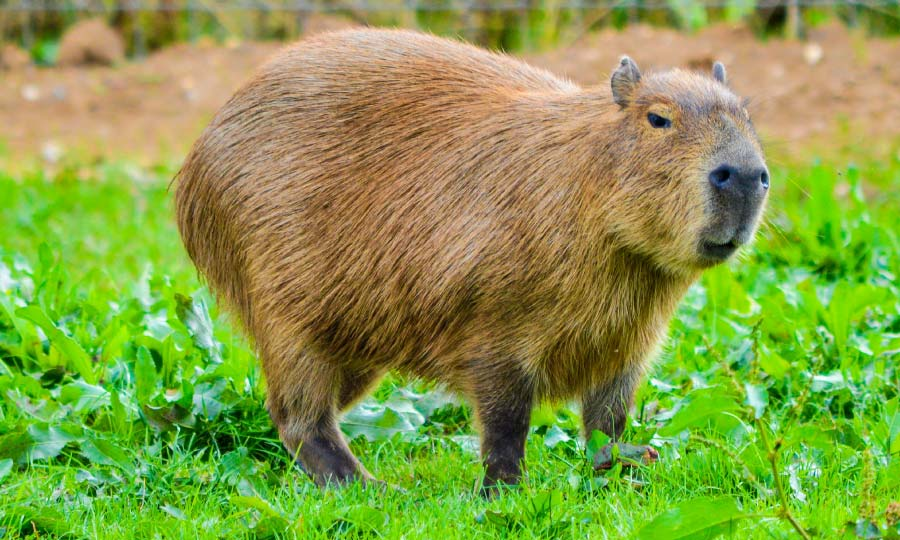
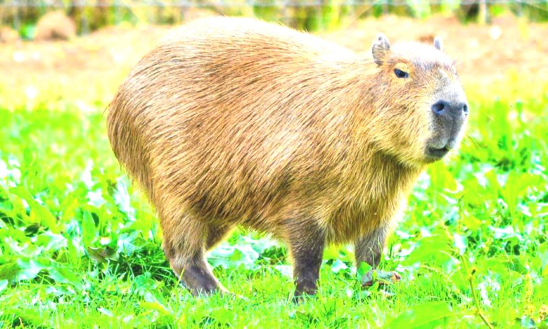
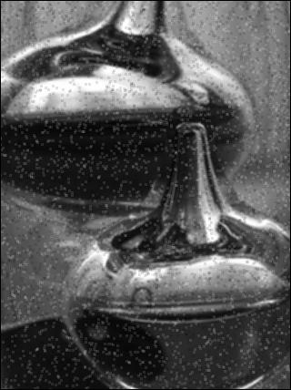
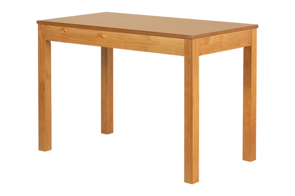
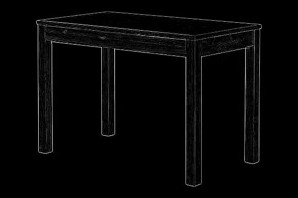

# Processamento Básico de Imagens

Conjunto de filtros criados em python

## 📌 Índice

- [Contrate e Brilho](#sobre-o-projeto)
- [Redução de Ruídos](#tecnologias-utilizadas)
- [Detecção de Bordas](#instalação)
- [Detecção de Formas e Texturas](#como-usar)
- [Transformações Geométricas](#funcionalidades)
- [Filtros Morfológicos](#autores)

---

## Contraste e Brilho

Definição da função principal responsável pelo ajuste de contraste e brilho. Ela recebe como parâmetros a imagem que será processada, além dos novos valores de contraste e brilho:
```python
 def ajutarBrilhoEContrate(imagem, brilho, contraste):

    largura, altura = imagem.size
    nova_imagem = Image.new("RGB", (largura, altura))
    pixels_originais = imagem.load()
    pixels_novos = nova_imagem.load()

    for x in range(largura):
        for y in range(altura):
            r, g, b = pixels_originais[x, y]

            r = int(contraste * r + brilho)
            g = int(contraste * g + brilho)
            b = int(contraste * b + brilho)

            r = max(0, min(255, r))
            g = max(0, min(255, g))
            b = max(0, min(255, b))

            pixels_novos[x, y] = (r, g, b)

    return nova_imagem

```


Dentro da função, utilizei `imagem.size` para capturar a largura e altura da imagem original. Em seguida, criei uma nova imagem com as mesmas dimensões e carreguei os pixels tanto da imagem original quanto da nova imagem que será gerada com o filtro aplicado:
```python
    largura, altura = imagem.size
    nova_imagem = Image.new("RGB", (largura, altura))
    pixels_originais = imagem.load()
    pixels_novos = nova_imagem.load()
```

 Utilizo um laço `for` aninhado para pecorrendo pixel por pixel da imagem e ir fazendo as modificações no brilho e contrante. A cada iteração, os valores RGB do pixel original são ajustados aplicando o contraste e o brilho, multiplicando o valor original do pixel pelo contrante e somando o valor do brilho. A função max e min garante que os valores fiquem no intervalo entre 0 e 255. Em seguida, os novos valores são atribuídos à nova imagem:
```python
  for x in range(largura):
      for y in range(altura):
          r, g, b = pixels_originais[x, y]
  
          r = int(contraste * r + brilho)
          g = int(contraste * g + brilho)
          b = int(contraste * b + brilho)
  
          r = max(0, min(255, r))
          g = max(0, min(255, g))
          b = max(0, min(255, b))
  
          pixels_novos[x, y] = (r, g, b)

```

<table align="center">
  <tr>
    <th>Imagem Original</th>
    <th>Imagem Processada</th>
  </tr>
  <tr>
    <td align="center">
      
    </td>
    <td align="center">
      
    </td>
  </tr>
</table>

---

## Redução de Ruídos (Filtro de Média)
Definição da função que foi criada para implementar o filtro de média. Essa função recebe o caminha para a imagem e o tamanho do karnel, que por padrão está definido como 3 (3x3), assim será sempre separda uma amostra de 9 pixels onde os 8 pixels ao redor do pixels do meeio serão 
utiliados para calcular a mediana.

```python
 def filtro_media(imagem_path, tamanho_kernel=3):
     imagem = Image.open(imagem_path).convert("L")
     imagem_np = np.array(imagem, dtype=np.float32)
 
     altura, largura = imagem_np.shape
     k = tamanho_kernel // 2
     imagem_filtrada = np.zeros_like(imagem_np)
 
     for y in range(k, altura - k):
         for x in range(k, largura - k):
             vizinhanca = imagem_np[y - k:y + k + 1, x - k:x + k + 1]
             media = np.mean(vizinhanca)
             imagem_filtrada[y, x] = media
 
     imagem_resultado = Image.fromarray(imagem_filtrada.astype(np.uint8))
 
     imagem_resultado.show()
     imagem_resultado.save("imagem/resultado/imagem_filtrada_media.jpg")

```
Abre a imagem e a converte para tons de cinza. E porteriormente converte a iagem para um array com valores em ponto flutante, para facilitar os cálculos matematicos

```python
 imagem = Image.open(imagem_path).convert("L")
 imagem_np = np.array(imagem, dtype=np.float32)
```

Já nessa parte do código, é feita uma fase de preparação, onde:
- Obtenho o valor da altura e largura da imagem
- Utilizo k para reprensetar quantos pixels o Kernerl se estende a partir do centro
- Crio uma nova imagem onde será salvo o resultado
  
```python
 altura, largura = imagem_np.shape
 k = tamanho_kernel // 2
 imagem_filtrada = np.zeros_like(imagem_np)
```
Para fazer a aplicação do filtro, utilizo o laço `for` aninhado para percorrer os pixels, onde para cada pixel extraio a vizinhança com base no tamanho do karnel e calculos a média dos valores vizinhos. E, por fim, atribuio o valor ao pixels xorrespondente na nova imagem.

<table align="center">
  <tr>
    <th>Imagem Original</th>
    <th>Imagem Processada</th>
  </tr>
  <tr>
    <td align="center">
      
    </td>
    <td align="center">
      
    </td>
  </tr>
</table>

---

## Detecção de Bordas (Laplace)

Matriz (kernel) utilizada para detectar bordas. Ela dá peso negativo aos vizinhos e um peso alto ao valor central. Ela faz isso com o objetivo de realçar pixels que são muito diferentes dos seus vizinhos, o que acontece em bordas

```python
laplaciano = [
    [-1, -1, -1],
    [-1,  8, -1],
    [-1, -1, -1]
]
```
Dentro da função principal, primeiramente faço uma preparação obtendo a altura e largura e carregando os pixels da imagem original. Tambem crio uma nova imagem em tons de cinza onde será guardado o resultado do filtro

```python
 largura, altura = imagem.size
 pixels = imagem.load()
 nova_imagem = Image.new("L", (largura, altura))
 pixels_novos = nova_imagem.load()
```

Posteriormente percorro os pixels internos, com um laço `for` aninhado, ignorando as bordas.

```python
 for x in range(1, largura - 1):
     for y in range(1, altura - 1):
         soma = 0
```

Dentro do laço aninhado, utilizo mais um `for` aninahdo para aplicar a máscara lplaciana em volta de cada pixel. Se o pixel estive em RGB, ele também será convertido pata tons de cinza, utilizando a fórmula de luminância

```python
        for i in range(3):
            for j in range(3):
                xi = x + i - 1
                yj = y + j - 1
                cor = pixels[xi, yj]

                if isinstance(cor, tuple):
                    cor = int(0.299 * cor[0] + 0.587 * cor[1] + 0.114 * cor[2])

```
Posteriormente multiplico o valor de cada vizinho pelo valor correspondente da máscara e acumulo a soma

```python
                soma += cor * laplaciano[i][j]

```

<table align="center">
  <tr>
    <th>Imagem Original</th>
    <th>Imagem Processada</th>
  </tr>
  <tr>
    <td align="center">
      
    </td>
    <td align="center">
      
    </td>
  </tr>
</table>

